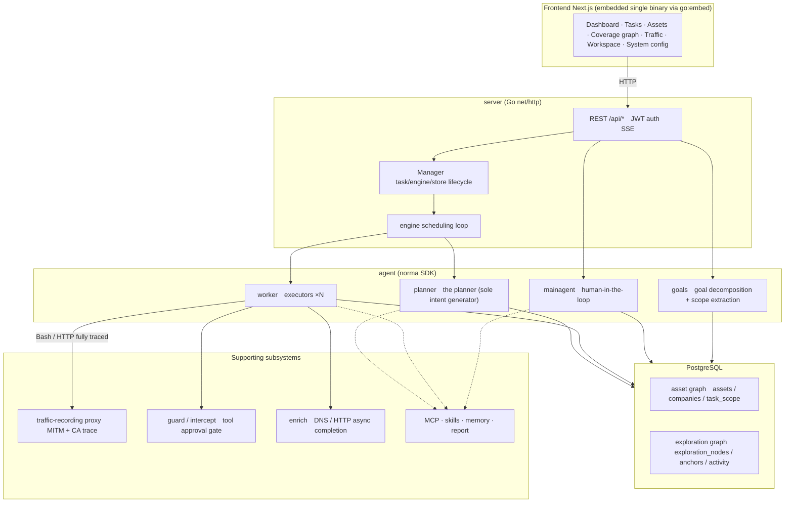
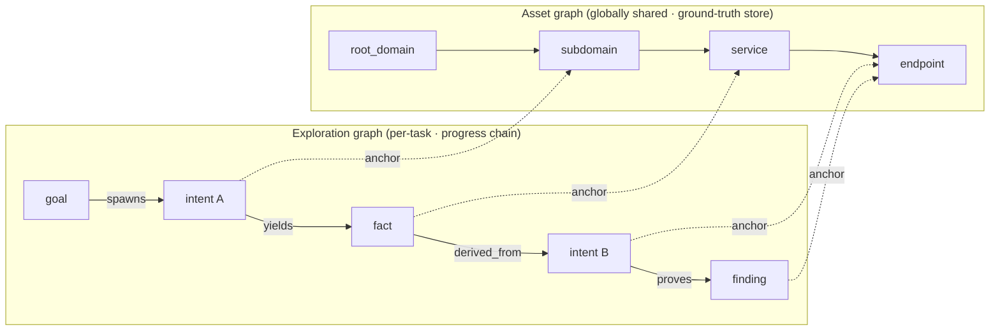
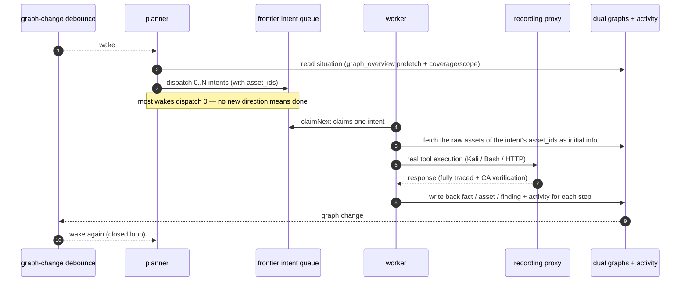
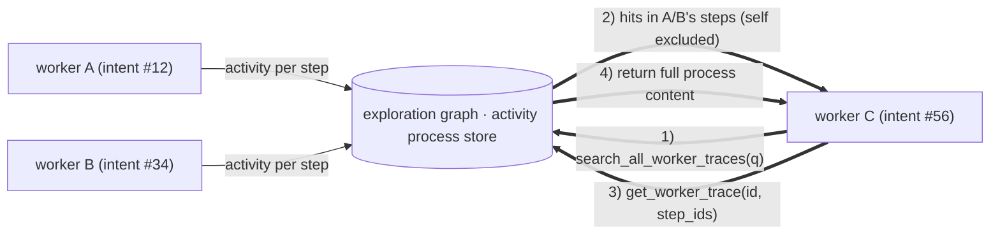
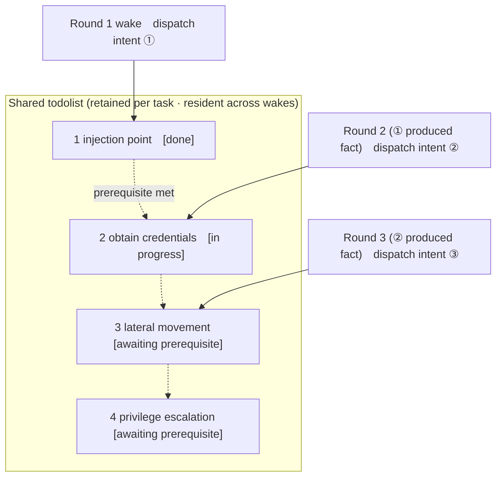

<div align="center">

# ARTEX

AI autonomous penetration testing system (Go backend + Next.js frontend)


🌐 **Live Demo**: `https://artex-demo.vercel.app/`

</div>

---

## Screenshot Preview

> For the full interactive experience, see the Live Demo (`https://artex-demo.vercel.app/`).

| Dashboard (Overview / Token usage / Activity feed) | Task list |
| :---: | :---: |
|  |  |

| Task · Execution process (Sessions / Tool calls) | Exploration graph |
| :---: | :---: |
|  |  |

| Findings | Assets |
| :---: | :---: |
|  |  |

| Asset coverage graph (force-directed layout · tested highlighting · collapsible/expandable nodes) |
| :---: |
|  |

| Traffic recording | Human-in-the-loop conversation |
| :---: | :---: |
|  |  |

| Agent management | LLM configuration |
| :---: | :---: |
|  |  |

| Interception approval | Backend logs |
| :---: | :---: |
|  |  |


---

## Approval Record Details

The global "Approval Records", the in-task "Interception Approval", and the approval cards in conversations all support expanding to view details. The display structure references
AegisHook's approval detail component (`https://github.com/RuoJi6/AegisHook/blob/main/web/src/components/CallDetail.vue`), following ARTEX's components and theme:


## Asset Sync (ScopeSentry)

Supports syncing asset data directly from ScopeSentry (`https://github.com/Autumn-27/ScopeSentry`), eliminating redundant collection:

- On the "**Asset Sync**" page, fill in the ScopeSentry address and API Key to connect the data source;
- Select the targets and asset types to sync by **project** or **task** dimension (domain / subdomain / IP / port / site / endpoint…);
- Import with one click and merge by the company's asset scope, feeding directly into ARTEX's asset graph for agents to explore and use.

---

## Installation

> Requires the **PostgreSQL** database; exploration requires an **LLM** to be configured (`ANTHROPIC_API_KEY` or `OPENAI_API_KEY`, which can also be set in the UI).

### Option 1: One-click install script (recommended)

```bash
git clone https://github.com/Autumn-27/ARTEX.git
cd ARTEX
./install.sh
```

The script will: detect / auto-install Docker → let you choose **① All Docker** or **② Build and run locally**:

- **① All Docker**: enter a Postgres password (press Enter for a random one) → automatically write `.env` → `docker compose up -d`.
- **② Local run**: choose a database (connect to an existing one / spin one up with Docker) → generate `config.json` → `go` compiles an embedded single binary → launch.

Once installed, open **http://localhost:8787** (on first visit go to `/setup` to set the admin password).

### Option 2: Docker Compose (manual)

```bash
git clone https://github.com/Autumn-27/ARTEX.git
cd ARTEX
cp .env.example .env          # fill in POSTGRES_PASSWORD, optionally ANTHROPIC_API_KEY
docker compose up -d          # pull the autumn27/artex image + postgres
# → http://localhost:8787
```

The image already includes common tools (ripgrep/curl/vim/npm/nmap…); `./skills` and `./data` are persisted as bind mounts.

Remote MCP can be configured in system settings as `http` (Streamable HTTP) or `sse` (legacy SSE).
Legacy SSE services typically establish an event stream via `GET /sse`, then receive JSON-RPC requests through the
`/message?sessionId=...` returned by the service; when configuring, set the URL to `/sse` and fill the header as
`Authorization=Bearer <token>`.

### Option 3: Download a prebuilt binary (Releases)

Go to Releases (`https://github.com/Autumn-27/ARTEX/releases`) and download the zip for your platform. After extracting, you get `artex` + `start.sh` (`start.bat` on Windows) + `skills/` + `config.example.json`:

```bash
cp config.example.json config.json   # fill in the database connection
./start.sh                           # → http://localhost:8787
```

> Please launch with `start.sh` / `start.bat` rather than running `./artex` directly. It is a guardian script: after the program exits, it decides whether to restart based on the exit code, and **the [one-click update](#option-1-in-page-one-click-update-recommended) on the page relies on it to swap in the new build**. If you run `./artex` directly, it won't be restarted after an update.
> To run in the background persistently: `nohup ./start.sh >artex.log 2>&1 &`.

### Option 4: Build a single binary from source

```bash
# 1) Static export of the frontend
cd web && npm ci && npm run build:static && cd ..
# 2) Copy into the embed directory
cp -r web/out server/webui/dist
# 3) Compile (-tags embedui embeds the frontend)
CGO_ENABLED=0 go build -tags embedui -o artex ./cmd/artex
./start.sh
```

### Option 5: Build cross-platform release archives

`build.sh` first builds and embeds the frontend, then uses the Go linker to strip debug information and compresses the release files into zip archives. In release mode it generates zip packages for Linux amd64/arm64, macOS amd64/arm64, and Windows amd64 by default:

```bash
./build.sh --release
# Output: dist/artex-0.3.3-*.zip
```

The UPX self-extracting binary may be incompatible with certain Linux kernels, virtualization environments, or security policies, so it is disabled by default. You can customize targets with `ARTEX_TARGETS`; when you have confirmed the target runtime is compatible, you can explicitly pass `--upx` to further shrink the binary:

```bash
ARTEX_TARGETS=linux/amd64,windows/amd64 ./build.sh --release
./build.sh --target linux/amd64 --upx
```

---

## Updates & Upgrades

> Upgrades only swap the program, not the data: the Postgres data volume `pgdata`, `./data` (jwt.key / SQLite, etc.), and `./skills` are all preserved. **Database migrations require no manual steps** — on each startup `artex` idempotently re-runs `schema.sql` (including `ADD COLUMN` / `CREATE INDEX IF NOT EXISTS`), i.e. "restart = migrate". It is still recommended to back up `./data` and the database before upgrading.

### Option 1: In-page one-click update (recommended)

On the **System Configuration** page (sidebar "System Configuration" → `/system/settings`), in the **Version & Update** card, you can check for and install new versions directly, without logging into the server.

After clicking "Update": download the release package for the current platform → compare against the Release's `SHA256SUMS` → smoke-test the new binary with `-h` → stage it as `artex.new` → the program exits, and `start.sh` / `start.bat` restarts it and completes the swap. The page automatically waits until the new version is online, then refreshes.

- **A failure never leaves a broken program**: if verification or the smoke test fails, the staged file is discarded and the current version keeps running; if the swapped-in new version fails to start 3 times in a row, it automatically rolls back to `artex.old` (the failed one is kept as `artex.failed` for troubleshooting).
- **You can roll back anytime**: the previous version is kept as `artex.old`, and the card has a "Roll back to the previous version" option. Note that database schema changes are not rolled back.
- **An update interrupts running tasks** — update means restart, so do it when idle.
- **Development builds are not offered updates**: disabled when the version number is `dev` or `git describe` carries a suffix, to avoid an official release overwriting a locally debugged binary.
- **Under Docker only the program is swapped, not the image**: the playwright / nmap and other toolchains in the image are not upgraded along with it, and after `docker compose up -d` recreates the container they revert to the versions bundled in the image. To upgrade the image too, still use `docker compose pull artex && docker compose up -d artex`.
- If accessing GitHub requires a proxy, just configure the **global proxy** on the same page, and the update pipeline will go through it. Updates are only downloaded from GitHub domains and forced over HTTPS.

### Option 2: One-click update script

```bash
cd ARTEX
./update.sh
```

The script first optionally runs `git pull` to fetch the latest code, then lets you choose **① Docker update** or **② Local build update** (corresponding to `install.sh`):

- **① Docker**: you can specify the target image tag (press Enter to use `.env`'s `ARTEX_TAG`, default `latest`) → `docker compose pull` → `docker compose up -d` (pulling the new image and restarting triggers migration automatically).
- **② Local**: rebuild the frontend static output → recompile `./artex` (restart the process afterward to take effect).

### Option 3: Docker Compose (manual)

```bash
cd ARTEX
git pull                       # update compose / scripts (optional)
# Specify a version: set ARTEX_TAG=v0.2.0 in .env; if unset, latest is used
docker compose pull artex
docker compose up -d artex     # pull the new image and restart → auto-migrate schema
docker image prune -f          # clean up old images (optional)
```

### Option 4: Prebuilt binary (Releases)

Go to Releases (`https://github.com/Autumn-27/ARTEX/releases`), download the new version zip, stop the old process, overwrite `artex` and `skills/` (keeping your `config.json` and `data/`), and restart:

```bash
cp -r <extracted dir>/skills ./ && cp <extracted dir>/artex ./
./start.sh
```

### Option 5: Build from source

```bash
git pull
cd web && npm ci && npm run build:static && cd ..
cp -r web/out server/webui/dist
CGO_ENABLED=0 go build -tags embedui -o artex ./cmd/artex
# Restart ./start.sh
```

---

## Configuration

**Database** (`config.json`, or override with the environment variable `ARTEX_PG_DSN`):

```json
{
  "database": {
    "host": "127.0.0.1", "port": 5432,
    "user": "artex", "password": "yourpass",
    "dbname": "artex", "sslmode": "disable"
  }
}
```

**LLM**: `export ANTHROPIC_API_KEY=sk-...` (or `OPENAI_API_KEY`), or fill it in on the UI's "LLM Configuration" page.
Optional: `ARTEX_LLM_PROVIDER` / `ARTEX_LLM_MODEL` / `ARTEX_LLM_BASE_URL` / `ARTEX_LLM_PROXY`.

**Concurrency**: the number of work agents per task is configured in "System Settings" (default 3).

**Common parameters**: `./start.sh -addr :8787 -proxy :8788` (`-addr` for frontend + API, `-proxy` for the traffic-recording proxy). The launch script passes the parameters through to `artex` verbatim.

### Reverse-proxy deployment (HTTPS / expose only 443)

The frontend and the API/SSE are served by the same backend port (default `:8787`), and the real-time activity stream uses the **same-origin** address by default, so there is **no need to configure `NEXT_PUBLIC_SSE_BASE`**: just expose 443 publicly and keep 8787 on the internal network.

SSE is a long-lived connection with continuous push, so the reverse proxy **must disable buffering**, otherwise the browser can connect but receives no events (manifesting as the activity stream spinning forever). Nginx example:

```nginx
server {
    listen 443 ssl;
    server_name your.domain.com;
    # ssl_certificate / ssl_certificate_key ...

    location / {
        proxy_pass http://127.0.0.1:8787;
        proxy_set_header Host $host;
        proxy_set_header X-Forwarded-Proto $scheme;

        # SSE essentials: disable buffering, long timeout, HTTP/1.1
        proxy_buffering off;
        proxy_cache off;
        proxy_read_timeout 3600s;
        proxy_http_version 1.1;
        proxy_set_header Connection "";
    }
}
```

> Only when SSE needs a different origin from the page (e.g. a separate subdomain) should you set `NEXT_PUBLIC_SSE_BASE` at **build time** (this variable is baked into the static bundle during `next build`; setting it at container runtime has no effect).

---


## Development

### Manual vulnerability re-testing

The "Re-test" tab in the task details lets you paginate through this task's vulnerabilities, view past conclusions and evidence, and manually initiate a re-test. After starting, it stays on the current tab, showing a spinner and "Re-testing"; once a fix is confirmed, the vulnerability status is updated accordingly.

Click "Re-test" in the action area of each row in the vulnerability list, or click "Initiate re-test" in the "Vulnerability re-test" section of the vulnerability details, and fill in the optional fix version, test conditions, or constraints. The system creates an independent re-test Agent session and, once started, stays on the current page. The flat list, the group-by-task view, and the asset view all support this entry point; while a re-test is running it shows a spinner and "Re-testing", and when you need to view it, click to enter the corresponding session, which reverts to "Re-test" when finished. Re-testing does not require restarting the original scan task; conclusions are categorized as "Still reproducible", "Fixed", or "Cannot confirm", and each conclusion, its evidence, and the session link are saved in the vulnerability details.

On first startup, the new backend pre-provisions an editable "Vulnerability re-test" (`retester`) Agent, whose prompt, LLM, run budget, and tools can be configured in Agent management. By default it uses its bound LLM, falling back to the globally active configuration if none is bound. When a re-test session completes successfully with a conclusion of "Fixed", the system automatically changes the vulnerability's disposition status to "Fixed"; in-progress, failed, stopped, or other conclusions keep the original status. The original evidence and report are always preserved. You can also manually select "Fixed" from the status dropdown. While the same vulnerability is being re-tested it reuses the existing session; after a stop, failure, or service restart it can be re-initiated.

In this version, the history is viewed through the vulnerability details and the session; it is not yet included in the vulnerability report export or the task archive bundle, nor is it automatically linked to the traffic capture. Demo mode only generates clearly labeled simulated records and does not make requests to real targets.

### Local run and testing

```bash
./dev.sh    # backend(:8787) + traffic proxy(:8788) + frontend next dev(:5173) → http://localhost:5173
```

- Backend: `go run ./cmd/artex` (without `-tags embedui` the frontend is not embedded)
- Frontend: `cd web && npm run dev` (`/api` reverse-proxied to the backend, with hot reload)
- Tests: `go test ./...`
- Mock preview (no backend): `cd web && NEXT_PUBLIC_MOCK=1 npm run dev`

---

## System Technical Architecture

ARTEX is an **LLM multi-agent-driven autonomous penetration system**: a Go monolithic backend (with an embedded Next.js frontend) + PostgreSQL, where agent capabilities are provided by the `norma` (`https://github.com/Autumn-27/norma`) SDK (`agentcore` / `tool` / `permission` / `harness` / `memory` / `transcript`). At its core is a **dual-graph architecture**, along with two autonomy mechanisms built around it: **process-level information exchange between workers** and a **planner multi-round shared todolist that stabilizes the attack chain**.

### Overall layering



| Layer | Responsibility |
| --- | --- |
| **Frontend** | Next.js static export, embedded into the single binary via `go:embed`; visualizes tasks/assets/exploration graph/coverage graph, and the human-in-the-loop conversation |
| **server** | `net/http` routing + JWT auth + SSE; `Manager` hosts the lifecycle of tasks, engines, and DB stores |
| **engine** | one `plannerLoop` + N worker goroutines per task; intent claiming, timeout/pause/drain |
| **agent** | goals / planner / worker / mainagent, with `ToolSet` exposing the dual graphs as LLM tools |
| **db** | Postgres persistence of the dual graphs (pgx); schema idempotently created on each startup via `go:embed` |
| **Supporting** | recording MITM proxy, approval gate, async completion, MCP/skills/memory/report |

### Dual-graph architecture: exploration graph + asset graph

The system splits "**what the target is**" and "**how thoroughly it has been tested**" into two mutually independent graphs, connected through anchors:

- **Asset Graph (globally shared)**: a ground-truth asset store shared across tasks. Nodes are `root_domain / subdomain / ip / service / app / endpoint`, belonging to a company; the domain→subdomain→service→endpoint parent-child relationships and the dedup keys are all computed by the program, and the agent only submits raw information.
- **Exploration Graph (per-task, independent)**: the "thinking and progress" process of a single task. Nodes are `goal / intent / fact / finding (vulnerability) / hint`, connected into a **lineage chain** via edges such as `spawns / derived_from / yields / proves`, answering "which direction was derived from which facts, and what did it produce".
- **The two graphs are connected via anchors**: `exploration_anchors(node_id, asset_id)` anchors intents/facts/vulnerabilities to specific assets — so you can see which assets an "exploration direction" is hitting, and conversely, for "a given asset", look up which intents tested it in this task and which facts were derived. This also powers the **asset test coverage** and the **asset coverage graph** (in-scope assets + tested highlighting).



> Division of labor: the **planner** reads the exploration graph's situation, judges the goal, and only dispatches an **intent** into the frontier when there is a new, uncovered direction; the **worker** claims **one intent**, executes it with real tools, writes the new assets/facts/vulnerabilities back to both graphs, and then stops. The asset graph is shared fact; the exploration graph is each task's progress chain.

### Engine and intent lifecycle (the closed loop of one exploration)

The engine is an **event-driven** closed loop: whenever the graph changes it wakes the planner, the planner dispatches intents, the worker claims an intent, executes it, and writes back; the write-back then triggers the next round — until the goal is proven (`prove_goal`).



### Process-level information exchange between workers

In one deep exploration, many valuable observations (a certain error, a certain response, a certain hidden parameter) appear in a worker's **execution process** but are not necessarily written up as a formal fact. To avoid duplicate effort and let workers along the chain stand on each other's shoulders, a worker has the ability to **search across the processes of other works**:

- `search_all_worker_traces(q)`: keyword-search within **the execution processes of other works in this task** (automatically excluding the steps of its own intent), with hits carrying an `intent_id`;
- `list_worker_traces` / `get_worker_trace(intent_id, step_ids=[…])`: first see which works have run, then fetch the full content of specific steps of a work for detailed exchange.

This way, even when there is no corresponding fact on the exploration graph yet, a later worker can reuse the observations from someone else's process — **information flows between workers at the granularity of the "execution process"**, while the boundary stays fixed (each worker still only does the one intent it claimed).



### planner multi-round shared todolist → a stable attack chain

A real attack chain is often a **multi-step sequence with dependencies between steps** (e.g.: find an injection point → obtain credentials → move laterally → escalate privileges), and dispatching these all in parallel at once would only cause chaos. The planner therefore holds a **planning todolist that is retained per task and shared across wakes**:

- the planner is event-driven — it is woken whenever the graph changes, but **each wake is a brand-new session**; the shared todolist lets it **record a serial exploitation chain once** and then **dispatch intents step by step across subsequent rounds according to dependencies**, rather than laying out the whole chain up front in a single round;
- each round it only dispatches an intent for the next step whose "prerequisite steps are complete and whose depended-on fact already exists", and it updates the list as progress is made (marking steps satisfied by a fact as complete).



So the attack chain still **advances stably, without duplication or misordering** in an "event-driven + stateless session" environment — this is the key to ARTEX being able to autonomously walk through a multi-step exploitation chain.

---

## Community Group

Scan the code to follow the WeChat Official Account **SecSentry**, and send a direct message in the account's backend to join the group for discussion.

<div align="center">


</div>

---
## References

`https://github.com/oritera/Cairn`


## License & Disclaimer

### Open-source license

This project is licensed under the **GNU Affero General Public License v3.0 (AGPL-3.0)**; the full terms are in the [LICENSE](LICENSE) file in the repository root.

This means anyone is free to use, modify, and distribute this project, but **derivative works must likewise be open-sourced under AGPL-3.0**; in particular, **if you modify this project and provide it to users over a network (such as deploying it as an online service), you must also make the corresponding complete source code available to those users**.

> ⚠️ **Important note**: the open-source license itself does not restrict the purposes for which the software may be used. The "usage restrictions" and "disclaimer" below are additional agreements and a solemn statement from the author to users; please be sure to abide by them.

**ARTEX is for personal study, code research, and local technical validation only, and must not be used to launch actual tests against any online system or website.**

### Permitted scope of use

- May only be used to **read, study, and research this project's source code**, and for technical-principle validation in a **local isolated environment**;
- Suitable for non-offensive purposes such as personal study, academic research, and code review.

### Prohibited activities

- **It is strictly forbidden to use this tool to launch scans, probes, exploitation, or attacks against any website, online service, or networked system** (whether or not authorized, and whether or not the asset is your own);
- It is strictly forbidden to use this tool for any actual penetration testing, offensive/defensive exercises, or production environments;
- It is strictly forbidden to use this tool for illegal intrusion, data theft, extortion, denial of service, or any destructive or criminal activity;
- It is strictly forbidden to use this tool to engage in conduct that violates the laws and regulations of your country/region.

### Compliance responsibility

Users must comply on their own with all laws and regulations of their country/region regarding cybersecurity, data protection, and computer crime (in mainland China this includes, but is not limited to, the Cybersecurity Law, the Data Security Law, the Personal Information Protection Law, and related judicial interpretations). **All legal liability and consequences arising from the use of this tool are borne solely by the user.**

### Disclaimer

This project is provided "AS IS", without any express or implied warranty. The author and contributors are not liable for any direct or indirect loss, data loss, system damage, or legal dispute caused by the use of this tool (whether or not used properly). **By downloading, installing, or using this project, you indicate that you have read, understood, and agreed to all of the above terms.**
